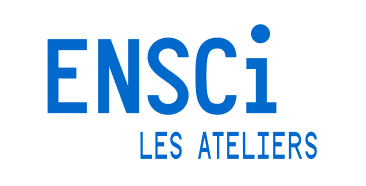
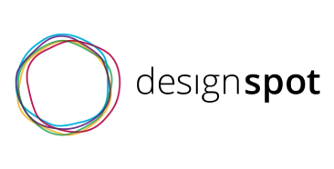
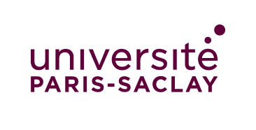
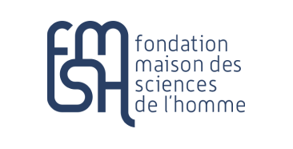
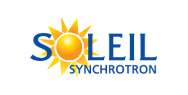
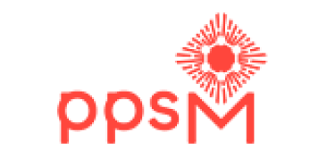
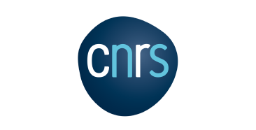

# À propos

Le Paléoscope est un projet mêlant recherche scientifique et réalité virtuelle imaginé, mené et développé par [Rémi Proietti](https://remiproietti.fr/) et [Malo de Widerspach](https://malo.widerspa.ch/), designers.

---

Ce site web a pour objectif de garder une trace des avancées du projet et de servir de documentation pour utiliser le Paléoscope.

**Remerciements :**

- Loïc Bertrand (Université Paris Saclay)
- Clémence Iacconi (Université Paris Saclay)
- Vincent Créance (DesignSpot)
- François Azambourg (ENSCI)
- Elena Tosi-Brandi (ENSCI)
- Veronica Rodriguez (ENSCI)

  
  
  
  
  
  
  

