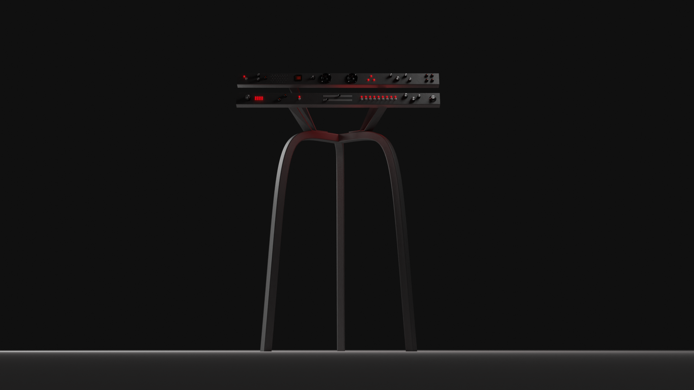

# À propos

Le Paléoscope est l’instrument ultime d’exploration de la matière.  
Réalité virtuelle et expériences tangibles au service de la recherche et de la médiation scientifique.

En septembre 2021, Rémi Proietti et Malo de Widerspach participent à l'atelier de projet recherche et design à l'ENSCI–Les Ateliers encadré par François Azambourg et Elena Tosi-Brandi. Nous travaillons avec le DesignSpot de l'Université Paris Saclay ainsi qu'avec plusieurs chercheurs dont Loïc Bertrand, physico-chimiste travaillant sur les sciences du patrimoine.

Partant du constat qu’il existe un décalage énorme entre les échantillons étudiés, leur plasticité, et les outils de la recherche. Nous avons créé le Paléoscope. 

Cet instrument permet de naviguer physiquement dans la matière par la réalité virtuelle.  
Grâce à des techniques tomographiques très avancées, on produit un clone virtuel de l'échantillon à étudier. On peut ensuite naviguer à l’intérieur, placer des repères, prendre des mesures et prélever des échantillons.

C’est un projet de médiation scientifique, dans le contexte du musée il permet au grand public de vivre une expérience de recherche.  
C’est aussi un projet d’exploration scientifique, un instrument qui permet aux chercheurs de se projeter dans de nouveaux usages, explorer un aspect multi sensoriel de la donnée et développer de nouvelles façon de travailler en équipe.

Ce site web a pour objectif de garder une trace des avancées du projet et de servir de documentation pour utiliser le Paléoscope.

**Remerciements :**

- Loïc Bertrand (Université Paris Saclay), porteur de projet
- Vincent Créance (DesignSpot), porteur de projet
- François Azambourg (ENSCI), designer
- Elena Tosi-Brandi (ENSCI), designer
- Veronica Rodriguez (ENSCI), coordinatrice atelier de projet
- Clémence Iacconi (Université Paris Saclay)

- ENSCI–Les Ateliers
- Université Paris Saclay
- DesignSpot
- Synchrotron SOLEIL
- Laboratoire PPSM
- Maison des Sciences de l'Homme
