# Phase 1

MSH Paris-Saclay

**Contexte**

Ce document constitue le livrable de la première phase du projet ImmArch3D mené avec Loïc Bertrand, Vincent Créance et James Auger et financé par la MSH Paris-Saclay sur l'exploration des matériaux du patrimoine avec une approche immersive.

**Objectifs de la phase**

La première phase de développement du Paléoscope V2 (première semaine de travail dans le cadre du financement par la Fondation Maison des Sciences de l’Homme), avait pour objectif d’établir précisément les scénarios d’usages du Paléoscope, et la suite d’outils à intégrer pour cela dans l’expérience immersive, ainsi que dans l’expérience sur écrans (smartphone, moniteur). 

Un autre objectif important était d’explorer, pour la première fois, les possibilités de visualisation et de navigation dans les données tomographiques de vrais échantillons, fournies par Clémence Iacconi en amont du sprint. Les résultats de cette recherche seront déterminants dans la suite du projet.

**TL;DR**

Le développement du projet Paléoscope consiste à mettre en place un écosystème d’interfaces virtuelles, afin d’offrir plusieurs angles de lecture d’un même sujet de recherche, autour d’un échantillon. Cet écosystème permettra de visualiser en réalité virtuelle un échantillon de différentes manières, et permettra de communiquer sur l’avancée d’une recherche de façon immersive et interactive.

Grâce à une architecture centralisée (serveur), l’expérience pourra se déployer et se décliner sur différents supports connectés (casque de VR, ordinateur, smartphone…) en fonction des moyens et des situations. Il proposera une expérience VR partagée en intégrant les acteurs hors VR, et en proposant une interaction augmentée avec l’échantillon, pour garantir l’adhésion des publics non initiés.

## A. Le Paléoscope V2

### A.1 Un instrument de visualisation et de manipulation des données réelles

#### A.1.1 Constat

Il existe déjà de nombreux logiciels, payants ou open sources, qui permettent la lecture et la visualisation des données tomographiques (par exemple Fidji, Avizo ou 3D slicer). Ces logiciels ont l’avantage d’être utilisés par une large communauté d’utilisateurs, qui contribue à faire évoluer ces instruments en développant des plugins. Le logiciel 3D slicer dispose par exemple d’un plugin pour naviguer en VR dans l’échantillon étudié. Ces outils sont souvent développés pour le domaine médical.

Ces logiciels ont la capacité d’importer et d’exporter une grande variété de formats de fichier, ce qui permet de transférer un échantillon d’un logiciel à l’autre pour en exploiter les particularités. On notera aussi qu’il est possible d’exporter des notes, points de repères et autres traces de recherche d’un logiciel à l’autre.

Dans ce contexte, il ne nous semble pas pertinent de développer un nouveau logiciel de recherche et de manipulation des données basé sur la réalité virtuelle. Les logiciels existent déjà, le plus efficace serait plutôt de développer un outil de visualisation et de phasage VR pour Fidji par exemple.

Les logiciels issus du monde du jeu vidéo tel que Unreal Engine sont conçus pour construire des expériences de jeu. À travers le développement d’interfaces graphiques, des intéractions avec l’environnement et un degré variable de scénarisation, le but est d’immerger le joueur dans un univers, et de l’y faire adhérer. Les logiciels de traitement de données sont puissants et précis mais manquent cruellement d’affordance auprès des utilisateurs. Ils sont donc voués à être utilisés par des utilisateurs aguerris (chercheurs) et ne permettent pas d’être approchés par un public plus large.

#### A.1.2 Proposition

Nous proposons de créer un outil de visualisation et de manipulation basique des données tomographiques basé sur un système de réalité virtuelle partagée. Partagée car l’expérience vécue en VR est monitorée sur d’autres supports en temps réel (ordinateur, écran, téléphone…). Notre outil se situe en aval de la chaîne de traitement des données, nous n’envisageons pas, pour le moment, la possibilité de lire des fichiers raw et de les éditer en VR. Les opérations de marquage, seuillage, phasage auront été réalisées en amont sur les logiciels existants déjà performants. Le but de cet outil est de visualiser en VR l’échantillon et son phasage.

Une évolution de cet instrument serait de proposer des outils de phasage au sein même de la VR. Avec pourquoi pas une expérience de phasage en collaboration, avec un chercheur sur PC, qui sélectionne et identifie des slices et des points d’intérêt, et un autre dans la VR qui peint précisément les zones à phaser en bénéficiant de la vue en 3D.

#### A.1.3 Fonctionnalités de l’outil

En VR : 

- navigation autour et dans l’échantillon

- manipulation de l’échelle de l’échantillon

- importation et ajout, de balises et de repères dessinés

- possibilité de sélectionner des slices

Sur les moniteurs : 

- Visualisation et choix de l’échantillon

- suivi en temps réel du déplacement de l’opérateur VR : 

    - suivi sur un modèle 3D

    - suivi sur une visualisation et coupe du modèle

- importation et ajout, de balises et de repères dessinés

### A.2 Un instrument de communication d’une recherche, liée à un échantillon particulier, qui s’adapte à différentes situations de médiation.

#### A.2.1 Constat

La communication d’une recherche scientifique donnée se fait le plus souvent par l’intermédiaire d’un article scientifique. Cet article est un pdf constitué de blocs de textes, d’images et de liens. Il peut être facilement stocké, partagé et imprimé.

Il devient cependant tout de suite moins pratique lorsqu’il s’agit de faire communiquer plusieurs recherches entre elles ou encore s’adresser à un public. Le format linéaire du pdf est adapté à la lecture mais pas vraiment à la déambulation et la découverte d’une recherche. De plus, quand il s’agit d’une recherche liée à des objets physiques le pdf ou le power point détachent de la physicalité de l’objet et rend le sujet relativement abstrait.

#### A.2.2 Proposition

Nous proposons de créer un outil de visualisation et de navigation dans la recherche, basé sur l’échantillon. 

L’échantillon, déjà étudié et traité, est intégré au logiciel de découverte. On peut alors choisir différents layers d’information, naviguer dans l’échantillon, sélectionner des éléments et afficher des points d’interprétation. L’objectif est de formaliser la recherche sous la forme d’une expérience immersive et intéractive.

Les données visualisées ne seront pas les données brutes, ce sera des morceaux extraits de la donnée brute, transformés le plus souvent en mesh, parfois re-modélisés, animés, simplifiés ou augmentés, selon les besoins.

#### A.2.3 Fonctionnalités de l’outil

Navigation en VR dans l’échantillon

- interaction avec les points d’intérêt

- ajout de balises

- ajout d’annotations dessinées

- capture et partage photographique

- prise de mesure

Interface web AR

- affichage de l’échantillon en réalité augmentée pour percevoir son échelle réelle. 

- Mise à jour des layers de visibilité

Interface web bureau

- Suivi des opérateurs VR en temps réel dans l’échantillon ( affichage 3D ou slice)

- Accès aux articles scientifiques associés

- partage d’infos et de médias avec les opérateurs VR

- Sélections des layers d’information à afficher

- ajout de balises

- ajout d’annotations dessinées

- téléportation des opérateurs VR dans l’échantillon 3D

### A.3 Infrastructure technique du Paléoscope

#### A.3.1 Paléoscope V1

La première version du paléoscope réalisée lors de l’Atelier de Projet “paléo-inspiration” à l’ENSCI–Les Ateliers en 2021 reposait sur une infrastructure en local :

- Les barres de contrôle : un gros contrôleur MIDI Arduino manipulable

- Un casque de VR (HTC Vive) dans laquelle un utilisateur explorait les scènes

- Un PC central qui faisait tourner Unreal Engine, réagissant aux signaux MIDI

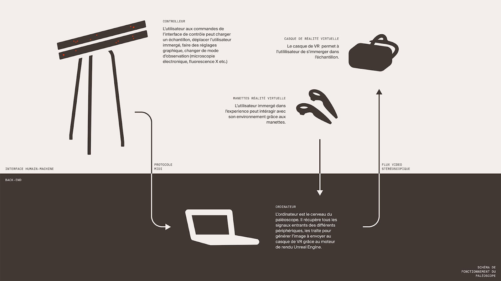Schéma du fonctionnement du Paléoscope V1

#### A.3.2 Paléoscope V2

Le paléoscope V2 revoit complètement son fonctionnement en se basant sur une architecture serveur centralisée.

Les clients (utilisateur VR, smartphone, site web, objet connecté…) se connectent à un échantillon sur le serveur qui leur envoie les informations dont ils ont besoin (géométrie, balises, notes, médias…). Ils peuvent ensuite envoyer des messages au serveur (par exemple à la création d’une nouvelle balise, au déplacement…) qui le transmettra à tous les autres clients en temps réel grâce aux websockets.

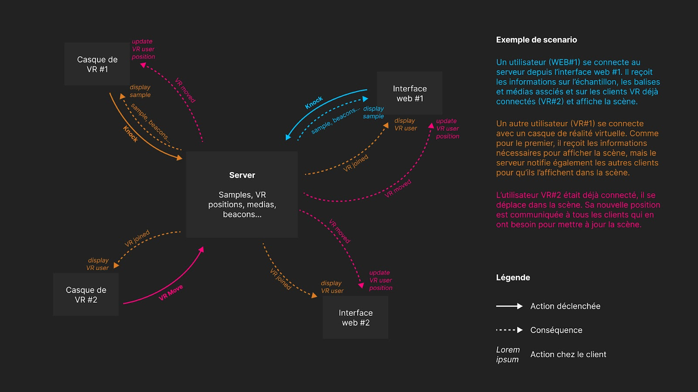Schéma du fonctionnement du Paléoscope V2

Cette architecture permet de concevoir beaucoup plus rapidement des dispositifs variés et sur mesure. Elle présente aussi l’avantage considérable de fonctionner en ligne et donc supprimer les contraintes matérielles (connectique…) et géographiques (les clients peuvent se retrouver dans l’échantillon en temps réel partout dans le monde).

### A.4 Traitement des données tomographiques

Dans la première version du paléoscope la navigation se faisait dans des échantillons fictifs. Nous avions recréé des scènes à partir d’images captées par différents types de microscopes. L’enjeu du Paléoscope V2 est de pouvoir travailler et explorer de la donnée réelle.

#### A.4.1 La donnée brute

A partir des piles d’images RAW produites par le scanner tomographique, nous avons expérimenté diverses manières de traiter les données afin de pouvoir les manipuler dans le Paléoscope. Il existe de nombreux logiciels, certains en libre accès, capables de lire ce type de données. Ils permettent de traiter, annoter et exporter les données dans de multiples formats.

Nomenclature des fichiers tomographiques :  
`Nom de l’échantillon_distance de propagation_energie_temps d’exposition_dimensions`

Exemple :  
`A172_320mm_68keV_50ms_aligned_3420x3420x512.raw`

#### A.4.2 Transformer la donnée pour Unreal Engine 5

Le logiciel Unreal Engine 5, que l’on utilise pour développer la partie VR de l’écosystème, est capable de lire un nombre assez restreint de fichiers.

Mesh : .OBJ, .FBX  
Voxel : .VDB  
Nuage de points : .E57

Pour convertir les données raw dans ces formats de fichier il faut passer par plusieurs logiciels. Parmi ceux que nous avons testés : Fidji(ImageJ), 3DSlicer, ParaView, Blender, CloudCompare

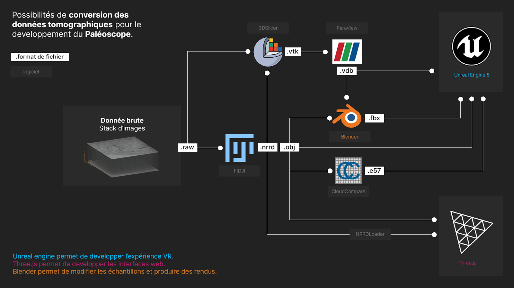Schéma de conversion des données

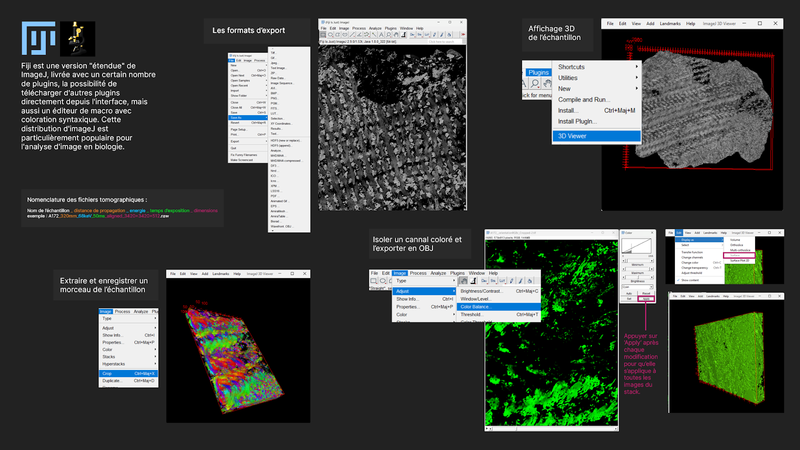Guide de navigation basique dans Fiji

#### A.4.3 Transformer la donnée pour le web

Pour le web, nous utilisons la librairie three.js qui permet de créer des scènes 3D avec WebGL. Cette librairie contient un *NRRDLoader* qui nous permet de lire des fichiers .NRRD, exportables depuis Fiji. Le navigateur permet d’afficher un échantillon aussi bien depuis un ordinateur que depuis un simple smartphone disposant d’une connexion internet, cependant, il n’a pas les capacités graphiques qu’offre Unreal et la taille des fichiers est restreinte. Nous avons pu y afficher des portions d’échantillons réduites en qualité (774x624x80 voxels 8-bit).

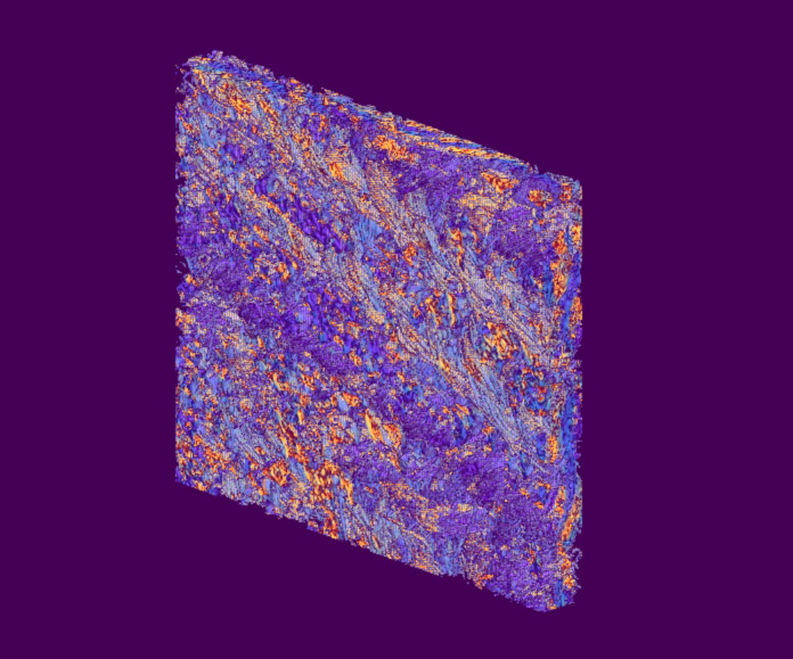 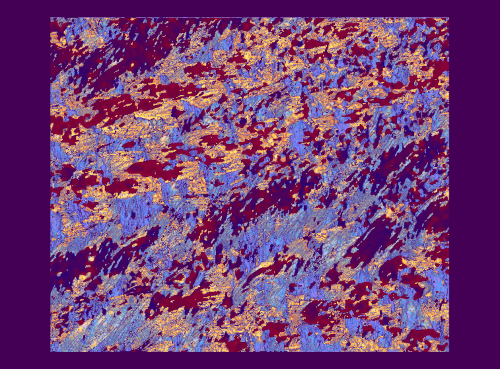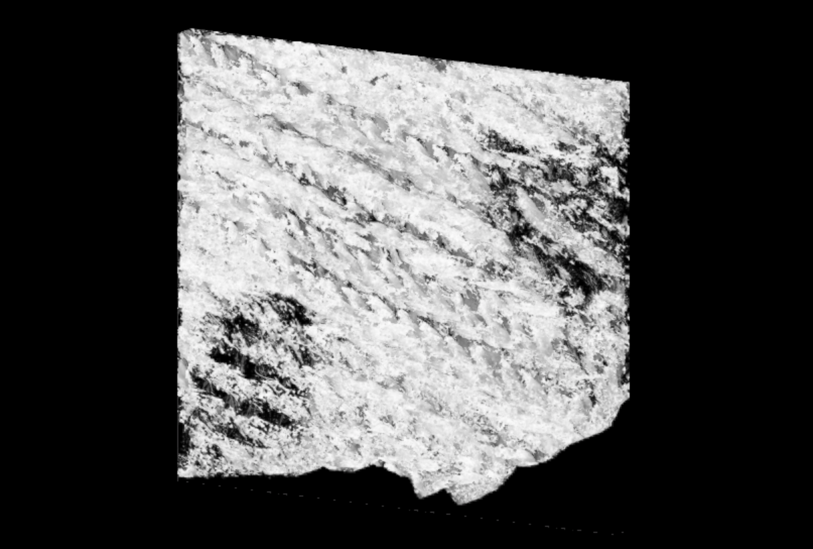 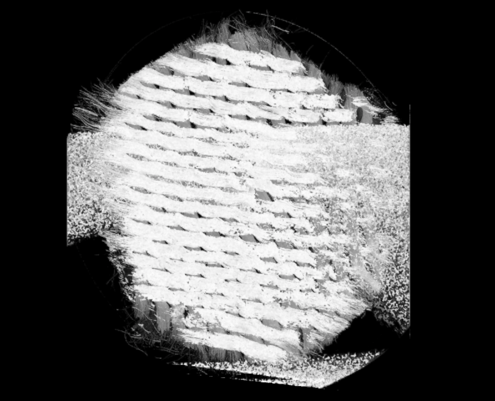  
Visualisation de données voxels sur l'interface web disponnible à l'adresse suivante : [paleoscopevolume.widerspa.ch](https://paleoscopevolume.widerspa.ch/)

#### A.4.4 Transformer la donnée pour Minecraft

En expérimentant avec les données voxels, nous avons voulu tester l’affichage d’un échantillon dans le jeu vidéo Minecraft. Pour cela, il nous a fallu exporter depuis Fiji en séquence d’images texte.

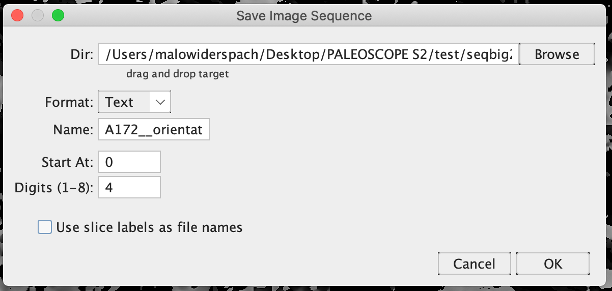

Nous obtenons un fichier .txt par couche avec les valeurs de chaque voxel. Un programme python s’occupe alors de lire ces fichiers textes et de créer une carte Minecraft (fichier .schem) avec la librairie *mcschematic* : pour chaque voxel, si la valeur est supérieure à un seuil défini, alors on place un bloc à cette position. Une fois le fichier schematic généré, on peut l’ouvrir dans le jeu grâce au plugin WorldEdit avec la commande *//schem load \[name\]* puis *//paste*.

 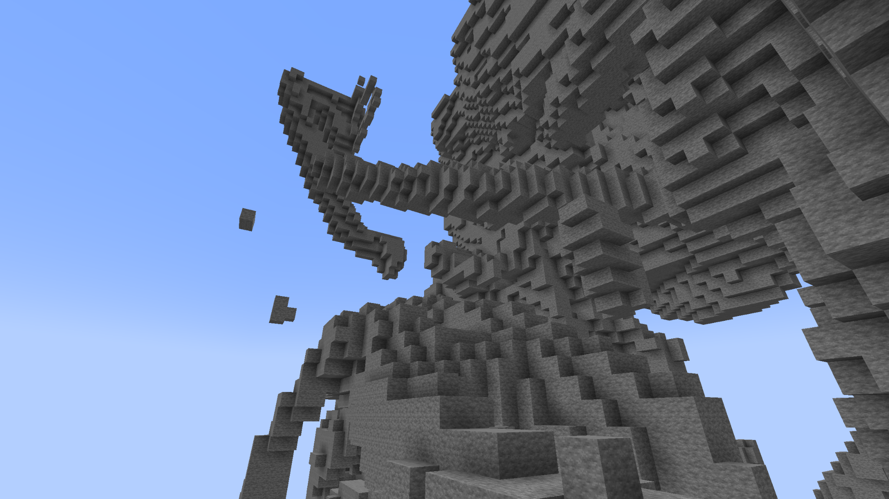 Affichage d'une portion d'échantillon de textile dans le jeu Minecraft

Cette expérience nous a permis de manipuler les données en profondeur et de mieux comprendre les différents formats de fichiers voxels. Bien que cette piste soit assez amusante, nous avons décidé de l’écarter pour le moment car elle ne nous permettait pas de développer une expérience personnalisée. De plus, l’importation d’un échantillon de plus d’un millions de voxels commence à peser très lourd et fait facilement crasher le jeu. Nous avons tout de même décidé de garder une trace de cette option qui pourra éventuellement resservir à l’avenir.

#### A.4.5 Interpréter la donnée avec Blender

Le logiciel de modélisation et de rendu 3D Blender, permet de manipuler des données en mesh, nuage de point et VDB (voxel data base). En important des fichiers VDB dans Blender on peut conserver les niveaux de gris de chaque voxel. A partir de ces informations, on peut venir appliquer des textures, des lumières et produire des rendus.

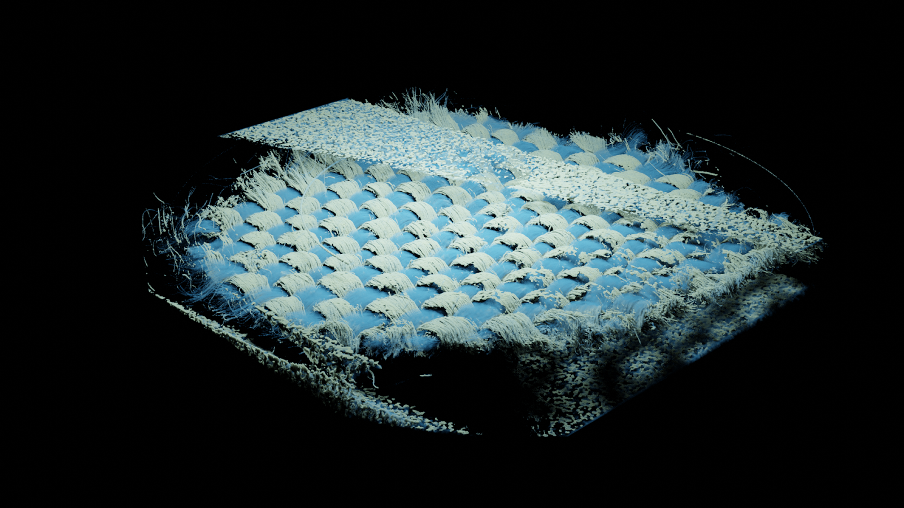 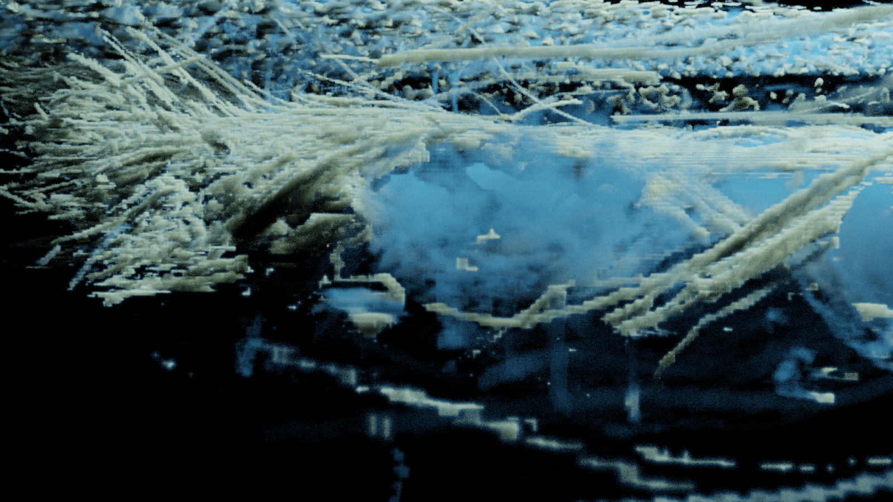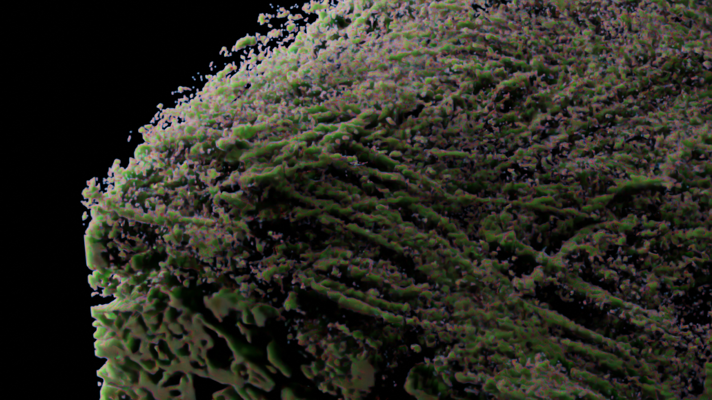 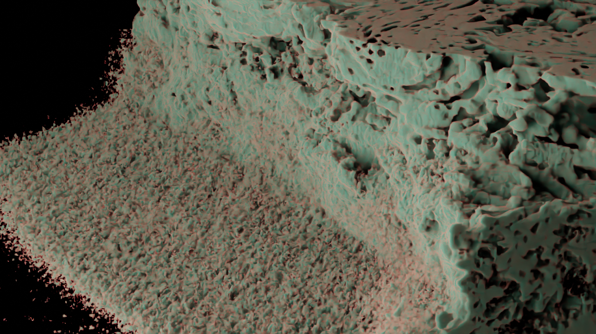Exemple de rendus (échantillon moderne et tablette)

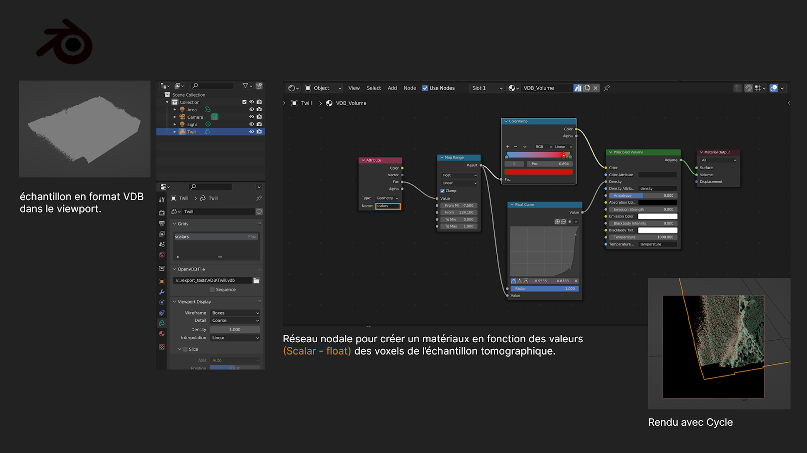  
Texturing d’un objet VDB

En plans rapprochés les échantillons ont un aspect vaporeux, chaque voxel représente un point sur un volume, il n’y a donc pas de vraies surfaces, de meshs. Une seconde technique consiste donc à convertir des données VDB en mesh. On perd alors les données de niveau de gris de l’échantillon. Pour cela on crée un cube à qui on applique un Modifier Volume to Mesh. On peut faire varier la densité de la géométrie en faisant varier le Voxel Amount.

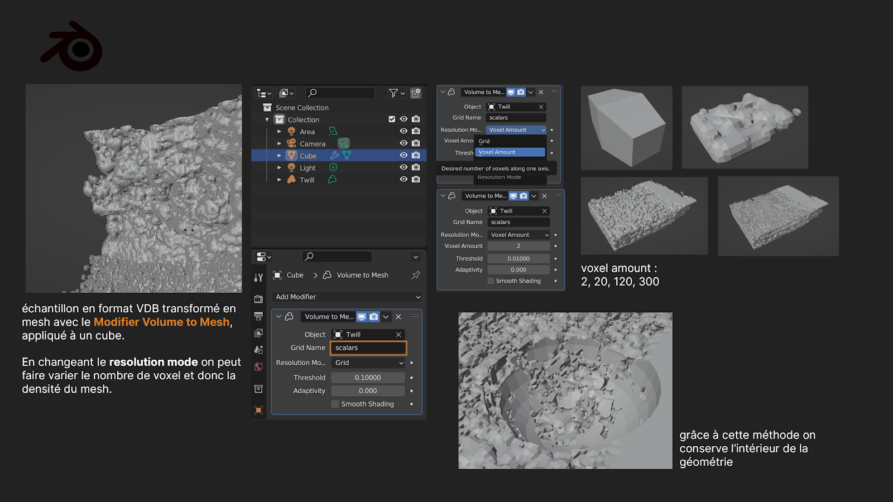

Enfin, lorsque l’on importe un fichier OBJ directement depuis Fidji dans Blender on peut utiliser l’outil decimate pour ajuster la résolution de la géométrie

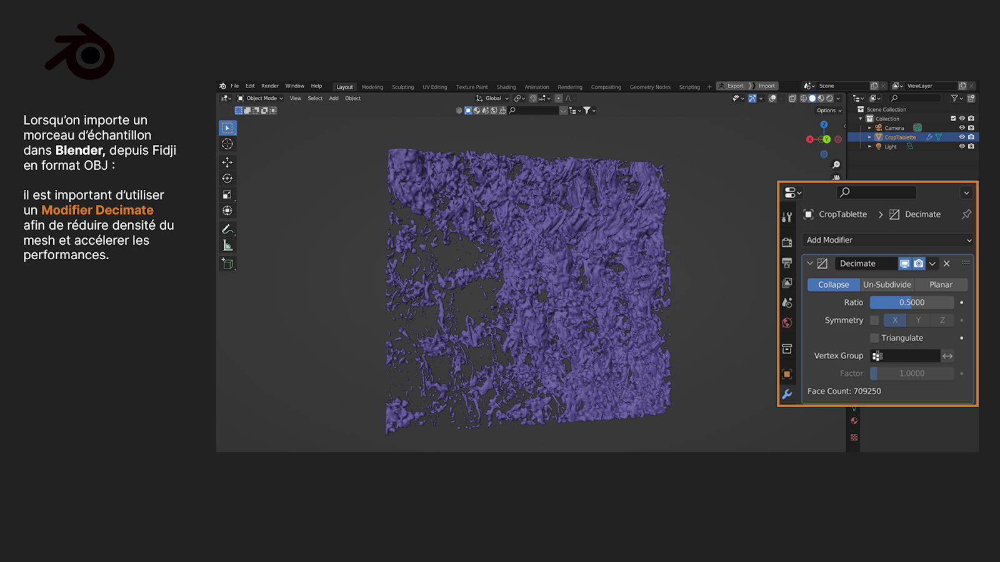

## B. Scénarios d’usage

### B.1 Conférence

Deux conférenciers, l’un dans la VR et l’autre sur l’interface web, présentent les étapes qui ont mené un travail de recherche au stade actuel. Le public est spectateur mais peut éventuellement observer l’échantillon ou autres informations en direct depuis son smartphone. Cette configuration est la configuration la plus simple à mettre en place, de laquelle découlent les quelques suivantes, plus spécifiques.  
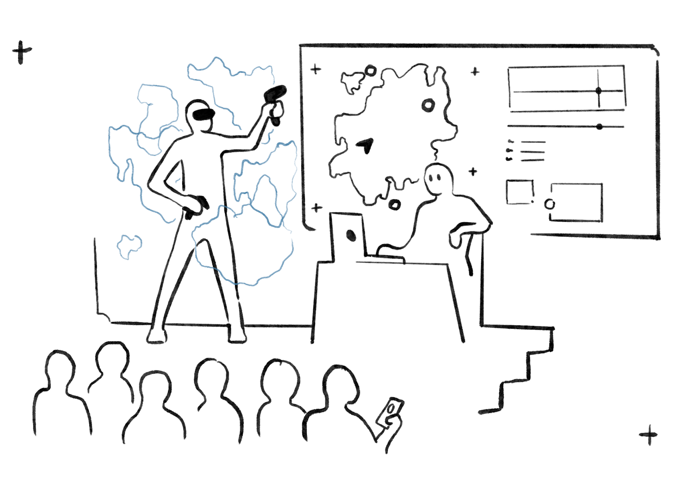

### B.2 Musée/Exposition

Ici le dispositif est en libre accès. L’expérience doit être guidée et ne présenter aucun point de blocage. On pourrait imaginer une expérience gamifiée où les deux participants doivent découvrir la provenance d’un échantillon de tissu, ou moins gamifiée qui permettrait juste de se balader dans un corpus d’échantillons scannées sélectionnables et réglables depuis l’écran (à la manière de la V1 du paléoscope lors du rendu à l’ENSCI).  
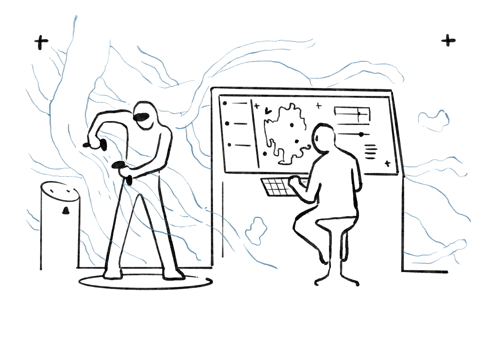

### B.3 Éducation

Dans le cadre d’un cours d’archéologie par exemple, l’intervenant pourrait expliquer certains processus chimiques ayant lieu dans la matière permettant de comprendre un échantillon en croisant le TP avec les connaissances théoriques des étudiants sur l’antiquité ou l'âge de fer.  
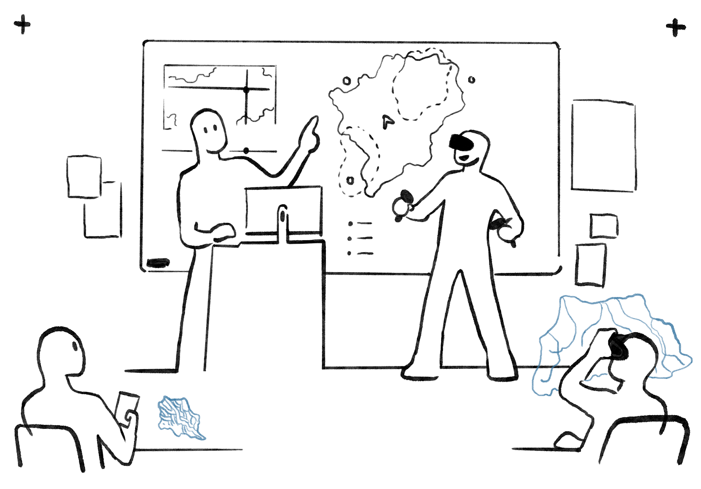

### B.4 Réunion de travail

La visualisation 3D immersive des échantillons, permet d’être interprétée intuitivement par de nombreux corps de métiers (archéologues, paléontologues, biologistes, historiens ou encore chimistes). Le Paléoscope peut servir de support de travail et de communication entre ces différentes compétences qui pourraient alors être réunies autour d’une table ou à distance.

 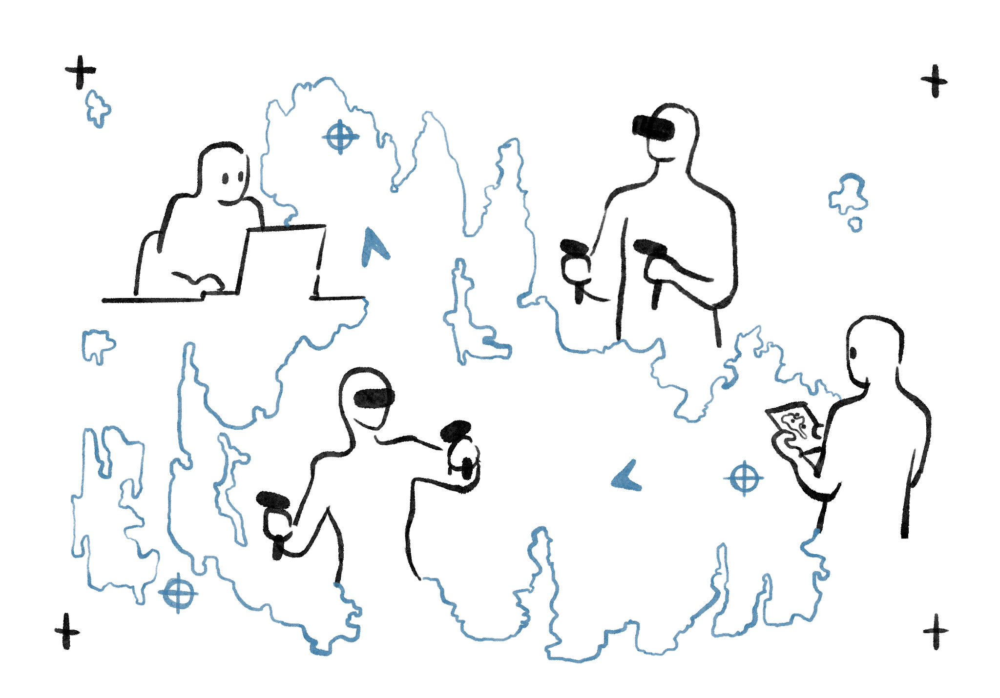

### B.5 Article augmenté

La version la plus simple du dispositif : la possibilité de voir l’échantillon en 3D et en réalité augmentée, à partir d’un simple QR code, pour accompagner un article scientifique. Par exemple, dans l’article de Clémence Iacconi sur le caractère aristocratique du site de Creney-le-Paradis, les vues 3 angles pourraient être affichées en 3D. On pourrait aussi envisager certains cas où une immersion simplifiée dans l’échantillon pourrait être intéressante et pourrait être réalisée avec un smartphone et un casque type Google Cardboard.  
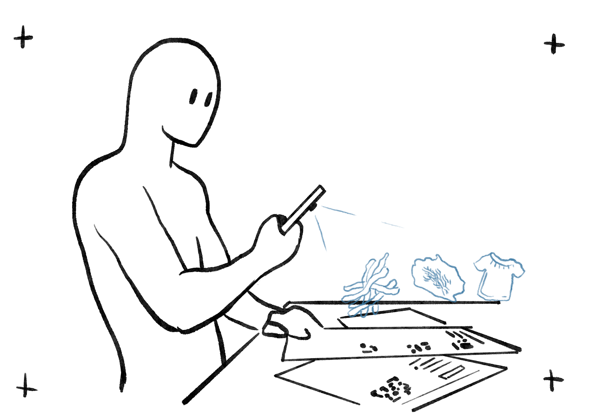

## C. Organisation de la phase 2 (prototype)

Les prochaines semaines (2 et 3) prévues dans le cadre du financement de la Fondation Maison des Sciences de l'Homme auront pour objectif de réaliser une preuve de concept/prototype fonctionnel de la deuxième version du Paléoscope formalisant les recherches et expérimentations réalisées lors de la période de stage et la première semaine MSH.

### C.1 Choix cas d'étude

Notre prototype se basera sur un cas d'étude spécifique : sujet de recherche, article scientifique… (par ex. article de Clémence Iacconi sur le caractère aristocratique du site de Creney-le-Paradis). Ce cas d'étude sera à définir avec Loïc Bertrand en amont des deux semaines de prototypage.

### C.2 Scénarios & Schéma technique

Nous commencerons ces deux semaines en décortiquant et en scénarisant l'expérience à partir du cas d'étude choisi. Nous nous projetterons dans les scénarios définis dans la section (B) et nous porterons notamment notre attention sur la configuration “conférence” (B.1) qui est la moins spécifique et permet d’aller par la suite sur d’autres configurations. Nous identifierons spécifiquement là où les outils du paléoscope interviendront.

À partir des scénarios, nous établirons un schéma technique des communications et réactions entre le serveur et les différentes interfaces du Paléoscope.

### C.3 Définition des outils et implémentation

Nous commencerons par implémenter le fonctionnement de ce schéma dans Unreal Engine pour que la VR réagisse bien aux messages du serveur.

Ensuite, nous définirons précisément les outils dans la VR et nous réfléchirons à la manière de répartir les différentes fonctionnalités nécessaires sur les boutons/interfaces des manettes du casque.

- Outils de dessin en 3D avec possibilité de faire varier le diamètre

- Outil pose de balise

- Afficher un média reçu du serveur

- Outil de mesure

- Réglage d'échelle (zoom)

- Navigation dans l'espace 3D

En parallèle, nous définirons les interfaces présentes sur la version web et la façon de les répartir

- Carte de l'échantillon

- Espace médias

- Console de commandes

- Changement du mode de vison (voxel/mesh)

- Création/édition balise

- Possibilité de réorganisation de l'espace en fonction du contexte

Nous concevrons et implémenterons ces outils et interfaces et évidemment l'affichage de l'échantillon dans la VR lors de ces deux semaines.

## D. Documentation

En parallèle de ces recherches, nous avons réfléchi à un moyen d’archiver, de communiquer et de documenter notre travail tout au long du projet Paléoscope. Nous avons créé un site internet très simple qui permettra de centraliser toutes les informations liées au projet, à la fois pour en parler simplement, mais aussi pour rassembler les notions techniques que nous avons apprises au cours de nos recherches.

Le site est disponible à l’adresse suivante : [paleoscope.widerspa.ch](https://paleoscope.widerspa.ch/). À l’heure où nous écrivons ces lignes il n’est pas complet et beaucoup d’informations manquent, mais la base est posée et prête à évoluer.
