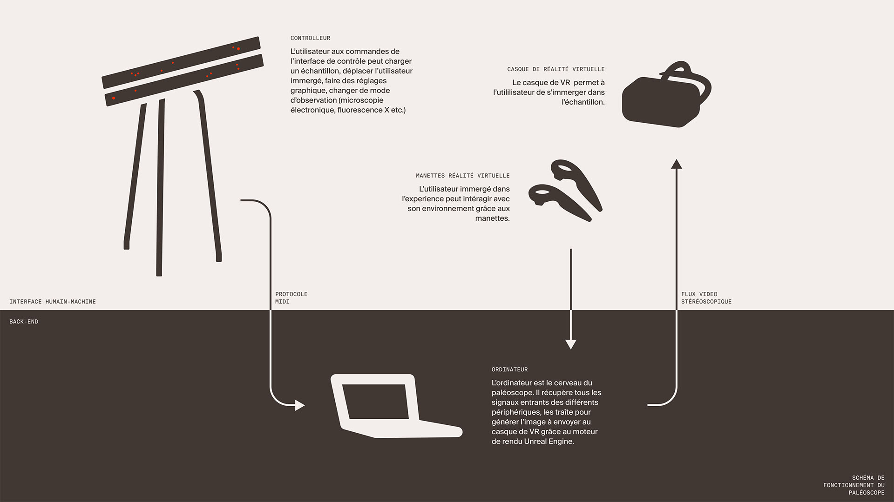
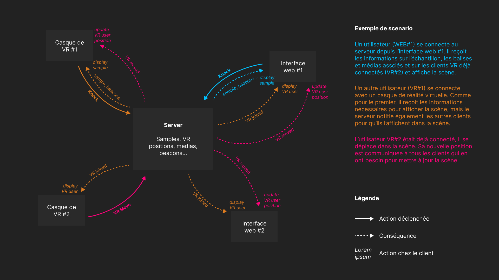

# Infrastructure technique du paléoscope

## Paléoscope V1

La première version du paléoscope réalisée lors de l'Atelier de Projet "Paléoinspiration" à l'ENSCI–Les Ateliers en 2021 reposait sur une infrastructure en local :
- Les barres de contrôle : un gros controlleur MIDI Arduino manipulable
- Un casque de VR (HTC Vive) dans laquelle un utilisateur explorait les scènes
- Un PC central qui faisait tourner Unreal Engine, réagissant aux signaux MIDI

## Paléoscope V2

Le paléoscope V2 revoit complètement son fonctionnement en se basant sur une architecture serveur centralisée.

Les clients (utilisateur VR, smartphone, site web, objet connecté…) se connectent à un échantillon sur le serveur qui leur envoie les informations dont ils ont besoin (géométrie, balises, notes, medias…). Ils peuvent ensuite envoyer des messages au serveur (par exemple à la création d'une nouvelle balise, au déplacement…) qui le transmettra à tous les autres clients en temps réel grâce aux websockets.

Cette architecture permet de concevoir beaucoup plus rapidement des dispositifs variés et sur mesure. Elle présente aussi l'avantage considérable de fonctionner en ligne et donc supprimer les contraintes matérielles (connectique…) et géographiques (les clients peuvent se retrouver dans l'échantillon en temps réel partout dans le monde).
